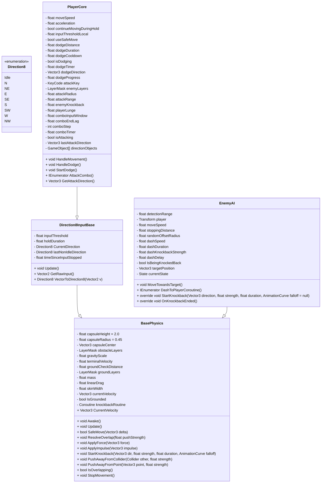

<<<<<<< Updated upstream
# Vertical-Slice

=======
# BasePhysics.cs — Transform-Based Character Physics System

**BasePhysics** is a lightweight, transform-driven physics helper for 2.5D and 3D character movement in Unity. It avoids Unity's Rigidbody in favor of explicit, deterministic integration of velocity, gravity, drag, and impulses, using capsule-based collision checks for stable and predictable character motion.

---

## Table of contents

- **Overview**
- **Key features**
- **Concepts & math**
- **Usage example**
- **Extensibility & hooks**
- **Tuning & tips**

---

## Overview

This class is intended to be a readable, deterministic foundation for players, enemies, and other moving entities where precise control is required. Movement is applied by modifying `transform.position` after running collision checks (capsule casts and overlap resolution).

Goals:

- Deterministic movement
- Fine-grained control over motion
- Simple, readable physics logic
- Easy extensibility through inheritance

---

## Key features

- Transform-based velocity integration (no `Rigidbody` required)
- Gravity with adjustable **gravityScale** and **terminalVelocity**
- Ground detection via raycasting
- Capsule-based collision checks (`CapsuleCast`, `OverlapCapsule`)
- Safe, collision-aware movement with **skinWidth** buffer
- Force and impulse application using physical formulas
- Knockback system with time-based falloff (configurable `AnimationCurve`)
- Overlap resolution to prevent clipping
- Helpers for push/impact responses (explosions, collisions)

---

## Concepts & math

- Coordinate system: `X/Z` → horizontal plane, `Y` → vertical (gravity)
- Velocity stored as world-space vector: `v = (vx, vy, vz)`

### Integration (Explicit Euler)

```
v(t + Δt) = v(t) + a · Δt
x(t + Δt) = x(t) + v(t) · Δt
```

### Gravity

```
a_y = -9.81 · gravityScale
v_y += a_y · Δt
// clamp: v_y >= -terminalVelocity
```

When grounded and `v_y < 0`, vertical velocity is reset to zero.

### Forces & impulses

- Continuous forces: `F = m · a` → `Δv = (F / m) · Δt`
- Impulses (instantaneous): `J = m · Δv` → `Δv = J / m`

### Linear drag (horizontal only)

```
v_xz *= clamp(1 - drag · Δt, 0, 1)
```

This is simple, stable, and arcade-friendly.

---

## Collision system

- Capsule geometry defined by `height`, `radius`, and `center` offset.
- SafeMove performs a `CapsuleCast` along the movement vector and moves by `hit.distance - skinWidth` to avoid penetration.
- Ground detection uses a downward raycast from the capsule center to determine `IsGrounded` and to zero out downward velocity when grounded.
- Overlap resolution uses `OverlapCapsule` and pushes the character out by a small correction to avoid getting stuck.

---

## Knockback

Knockback is implemented as a time-based velocity override (typically via a coroutine):

```
v(t) = direction · (strength · falloff(t))
position += v(t) · Δt
```

`falloff(t)` is an `AnimationCurve` to provide smooth or sharp decay.

---

## Basic usage example

```csharp
public class PlayerPhysics : BasePhysics
{
    protected override void Update()
    {
        base.Update();
        // SafeMove expects a world-space delta (e.g., velocity * Time.deltaTime)
        SafeMove(CurrentVelocity * Time.deltaTime);
    }

    protected override void OnSafeMoveBlocked(RaycastHit hit)
    {
        // Custom behavior: sliding, sounds, state changes, etc.
    }
}
```

Hook highlights:

- `SafeMove(Vector3 delta)` — moves with collision checks and returns whether movement was fully successful
- `OnSafeMoveBlocked(RaycastHit hit)` — called when movement is blocked
- `OnKnockbackEnded()` — called when knockback completes

---

## Class diagram

Below is a compact class-diagram representation of `BasePhysics` (Mermaid format) showing main fields, properties, and methods.



Notes:

- The knockback flow is: `StartKnockback()` → `KnockbackCoroutine()` (sets `currentVelocity`, calls `SafeMove()`) → `OnKnockbackEnded()`.
- Collision checks rely on `Physics.CapsuleCast` / `Physics.OverlapCapsule` and use `skinWidth` to avoid penetration.

---

## Why not use Rigidbody?

This approach intentionally avoids `Rigidbody` to provide:

- Deterministic behavior and easier debugging
- Full control over movement and collision response
- Predictable and arcade-like responses ideal for character controllers and action games

---

## Tuning & tips

- Keep `skinWidth` small but > 0 to avoid jitter and floating-point penetration.
- Use `terminalVelocity` to cap fall speed.
- Adjust `gravityScale` and `drag` for the desired feel (floaty vs. snappy).
- Use `AnimationCurve` for knockback to get the exact combat feel you want.

> Note: This system favors clarity and control over full physical realism — tune values to match your game's gameplay goals.

---

## Contributing & License

- Contributions: Open a PR with a focused change and tests/examples.
- License: See the repository `LICENSE` file for details.

---

Happy building!

For questions or help integrating `BasePhysics` into your project, open an issue or contact the maintainers.
>>>>>>> Stashed changes
